placa robotica |pcb|
====================

El hardware |pcb| esta basado en el micro controlador 18f4550 (o 18f2550), un
hardware con un bootloader y librerias usados en el proyecto PINGUINO.

caracteristicas tecnicas
------------------------

la placa |pcb| cuentac con:
- 8 conversores analogicos (el micro controlador soporta 10)
- 4 entradas para sensores digitales
- 8 salidas digitales al PORTB (UNL2803)
- 2 salidas para motores de corriente continua ( L293B)
- 5 salidas de PWM para Servos (el micro controlador soporta hasa 18)

listado de componentes
----------------------

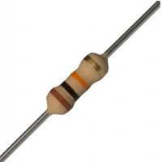

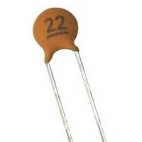

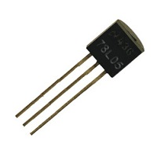

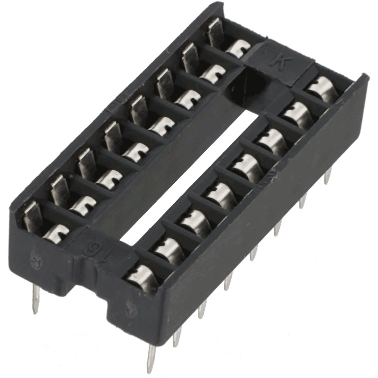

.. |zocalo-20|  image:: _static/img/hardware/componentes/zocalo-20.jpg
   :width: 40pt
   :height: 40pt

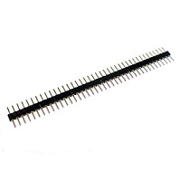

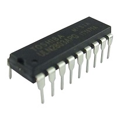

========  ==================================== ======================================== ===========================
Cantidad  Componente                           Ubicación                                imagen
========  ==================================== ======================================== ===========================
11        Resistencias 470 Ohm - 1/4W          R1 R2 R3 R4 R5 R6 R7 R8 R9 R12 R17       |R10K|
5         Resistencias 10k Ohm - 1/4W          R11 R13 R14 R15 R16                      |R470|
2         Capacitores Cerámicos 22pF           C2 C3                                    |C22pf|
5         Capacitores Cerámicos 0.1uF          C9 C10 C11 (C12 C13)*                    |C01uf|
1         Capacitor Cerámico 220nF             C1                                       |C220nF|
1         Capacitor Electrol. 10uF 16V         C5                                       |Celectrolitico|
4         Capacitor Electrol. 100uF            C4 C6 C7 C8                              |Celectrolitico100|
3         Diodos 1N4007                        D9 D12 D14                               |D1n4007|
11        Leds difusos 5mm                     D1 D2 D3 D4 D5 D6 D7 D8 D10 D11 D12      |led|
1         Conector USB hembra Tipo B           J1                                       |usb|
========  ==================================== ======================================== ===========================

========  ==================================== ======================================== ===========================
Cantidad  Componente                           Ubicación                                imagen
========  ==================================== ======================================== ===========================
1         Push Button (Soft Touch)             SW2                                      |pushbutton|
1         Regulador de Voltaje LM7805          U4                                       |lm7805|
1         Regulador de Voltaje 78L05           U5                                       |78l05|
7         Borneras Dobles                      P8 P9 P10 P11 P12 P13 P14                |bornera|
1         Zócalo de 8x2 Pines                  U3                                       |zocalo-8|
1         Zócalo de 20x2 Pines                 U2                                       |zocalo-20|
1         Zócalo de 9x2 Pines                  P6                                       |zocalo-9|
1         Cristal de 20Mhz                     X1                                       |cristal-20mhz|
2         Tira Postes Macho de 40 Pines        K2 K3 K4 K5 K6 SW1 SW3 K1 K8 P4          |pinesmacho|
1         Tira de Postes Hembra de 40 Pines    P1 P7 P5 P15 P16 P17 P18                 |pineshembra|
1         Driver L293D (Puente H)              U3                                       |L293D|
1         Integrado ULN2803                    P6                                       |uln2803|
1         Microcontrolador PIC18F4550          U2                                       |pic18f4550|
4         jumper                               SW1 SW3 K1 K8                            |jumper| 
========  ==================================== ======================================== ===========================

herramientas
------------

Las herramientas que necesitamos para armar una placa robotica |pcb| 
son faciles de conseguir y muy comunes para cualquier 
hobbista de la electronica.

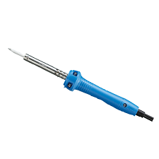
  
  Soldador

Un soldador eléctrico o de estaño, también conocido como cautín, es 
una herramienta eléctrica usada para soldar. Funciona convirtiendo 
la energía eléctrica en calor, que a su vez provoca 
la fusión del material utilizado en la soldadura, como por 
ejemplo el estaño.

.. raw:: latex

    \newpage

.. figure:: _static/img/hardware/herramientas/estanio.png
  :align: center
  :figclass: align-center
  :width: 300pt
  
  Estaño

El estaño que se utiliza en electrónica tiene alma de resina con el fin 
de facilitar la soldadura. Para garantizar una buena soldadura es 
necesario que tanto el estaño como el elemento a soldar alcancen una 
temperatura determinada, si esta temperatura no se alcanza se produce 
el fenómeno denominado soldadura fría. La temperatura de fusión 
depende de la aleación utilizada, cuyo componente principal es 
el estaño y suele estar comprendida entre unos 200 a 400 ºC.

En realidad, el término "estaño" se emplea de forma impropia 
porque no se trata de estaño sólo, sino de una aleación de este metal 
con plomo, generalmente con una proporción respectiva 
del 60% y del 40%, que resulta ser la más indicada para 
las soldaduras en Electrónica.

Para realizar una buena soldadura, además del soldador 
y de la aleación descrita, se necesita una sustancia adicional, 
llamada pasta de soldar, cuya misión es la de facilitar la distribución 
uniforme del estaño sobre las superficies a unir y evitando, al mismo 
tiempo, la oxidación producida por la temperatura demasiado elevada 
del soldador. La composición de esta pasta es a base de colofonia 
(normalmente llamada "resina") y que en el caso del estaño que 
utilizaremos, está contenida dentro de las cavidades del hilo, 
en una proporción del 2~2.5%.

.. raw:: latex

    \newpage

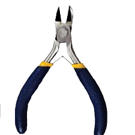
  
  alicate para electronica

Un pequeño alicate, para poder cortar el excedente de material (estaño, 
alambres de las resistensias por ejmplo).

.. raw:: latex

    \newpage
    
.. figure:: _static/img/hardware/herramientas/destornillador.png
  :align: center
  :figclass: align-center
  :width: 300pt
  
  destornillador plano pequeño

Nos sirve para ajustar las borneras y para hacer palanca para sacar un 
integrado que hayamos puesto en un zocalo.

.. raw:: latex

    \newpage
    
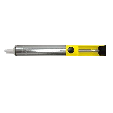
  
  desoldador de estaño
  
El desoldador de estaño, nos permite sacar el estaño que hayamos puesto 
de mas o para remplazar algun componente efectuoso de la placa robotica |pcb|

.. raw:: latex

    \newpage
    

fabricacion
-----------

A continución veremos el paso a paso del armado de la placa |pcb|.

paso 0
*******

  
  Vista de la Placa

.. raw:: latex

    \newpage
    
paso 1
*******

  
  Colocar 5 Puentes

.. raw:: latex

    \newpage
 
paso 2
*******

  
  Resistencias de 470 Ohm

.. raw:: latex

    \newpage
 

paso 3
*******

  
  Resistencias de 10K Ohm

.. raw:: latex

    \newpage
 
paso 4
*******

  
  Diodos 1N4007

.. raw:: latex

    \newpage
 
paso 5
*******

  
  Cristal de 20MHz

.. raw:: latex

    \newpage
 
paso 6
*******

  
  Capacitores Cerámicos 0,1uF

.. raw:: latex

    \newpage
 
paso 7
*******

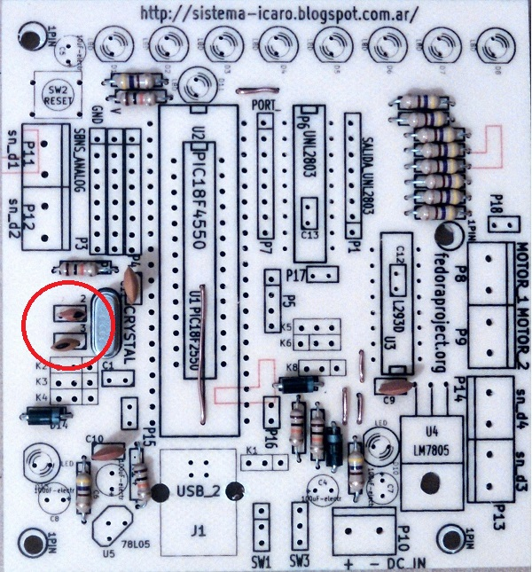
  
  Capacitores Cerámicos 22pF

.. raw:: latex

    \newpage
 

paso 8
*******

  
  Capacitor Cerámico 220nF

.. raw:: latex

    \newpage
 

paso 9
*******

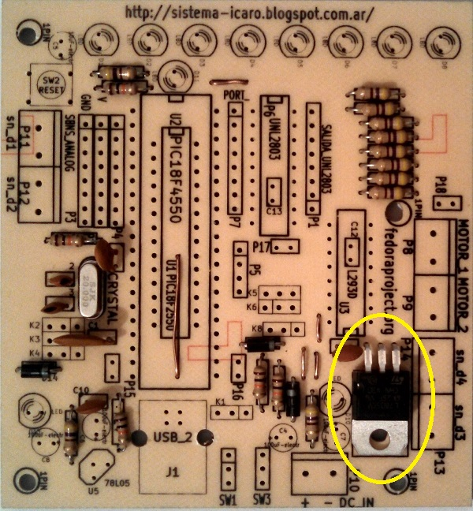
  
  Regulador LM7805

.. raw:: latex

    \newpage
 

paso 10
*******

  
  Regulador 78L05

.. raw:: latex

    \newpage
 
paso 11
*******

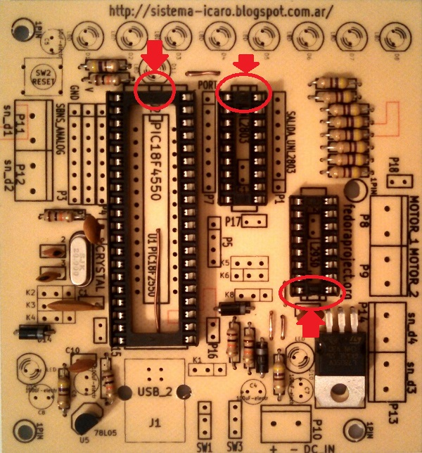
  
  Colocar Zócalos

.. raw:: latex

    \newpage
 
paso 12
*******

  
  Push Button

.. raw:: latex

    \newpage
 
paso 13
*******

  
  Colocar LEDS

.. raw:: latex

    \newpage
 

paso 14
*******

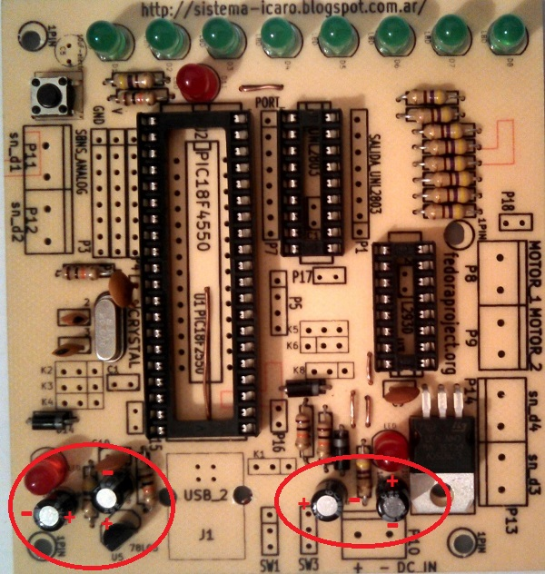
  
  Capacitores Electrolíticos 100uF

.. raw:: latex

    \newpage
 
paso 15
*******

.. figure:: _static/img/hardware/pasos/15b.jpg
  :align: center
  :figclass: align-center
  :width: 300pt
  
  Capacitor Electrolítico 10uF

.. raw:: latex

    \newpage
 

paso 16
*******

  
  Postes Macho

.. raw:: latex

    \newpage
 
paso 17
*******

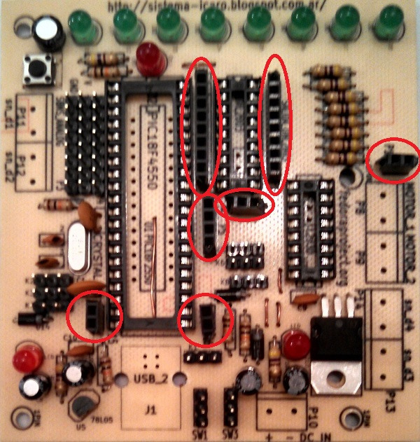
  
  Postes Hembra

.. raw:: latex

    \newpage
 

paso 18
*******

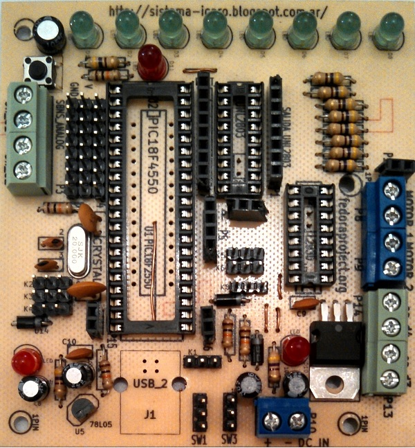
  
  Borneras

.. raw:: latex

    \newpage
 

paso 19
*******

  
  Conector USB hembra B

.. raw:: latex

    \newpage
 

paso 20
*******

  
  Capacitores Cerámicos 0,1uF

.. raw:: latex

    \newpage
 
